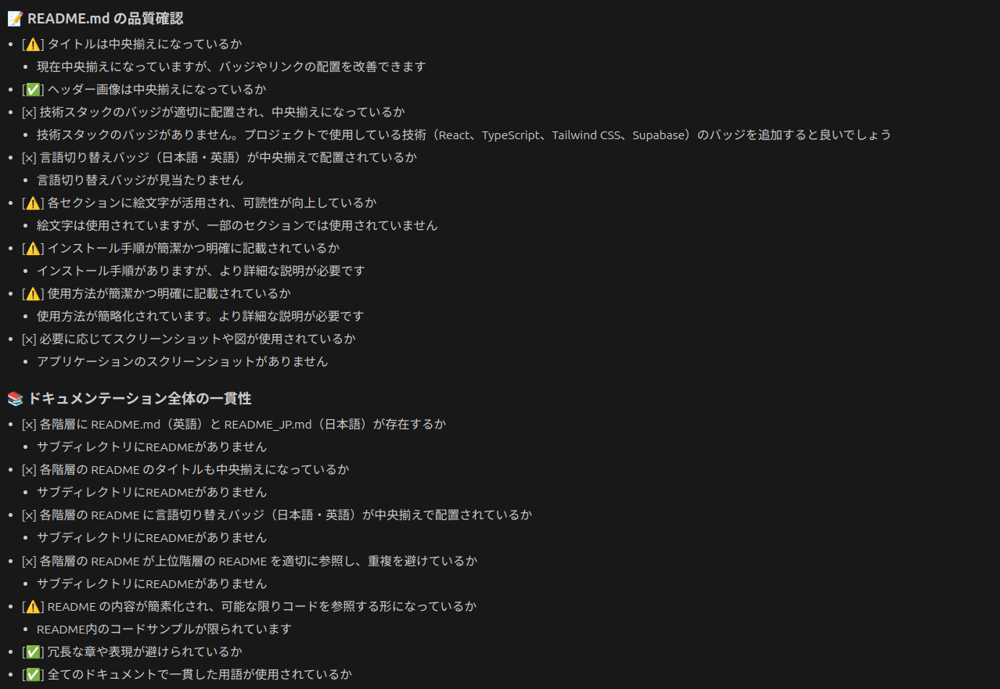
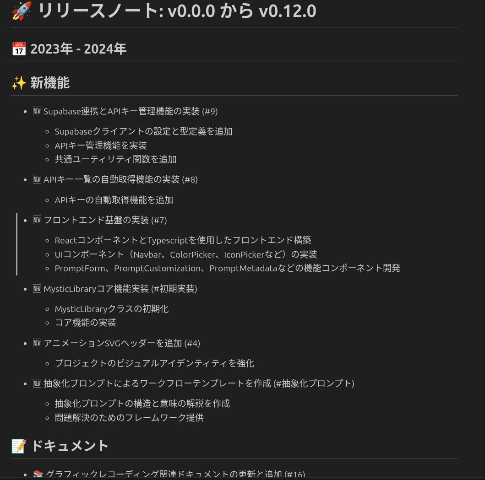

<h1 align="center">Software Checker MCP</h1>

<p align="center">
   	<a href="README_JP.md"></a>
	<a href="README.md"></a>
</p>

<p align="center">
    
    
</p>

このMCPサーバーは、Gitリポジトリの品質確認とリリースノート生成を支援するツールです。

## 📋 機能

1. **🔍 リポジトリ品質確認**: リポジトリの構造、ドキュメント、コード品質などを包括的にチェックし、改善点を提案します。
2. **📝 リリースノート生成**: 指定したGitタグ間の変更を分析し、構造化されたリリースノートを自動生成します。

## 💡 詳細機能説明

### 🔍 リポジトリ品質確認
repository_quality_check 関数はリポジトリの品質を総合的に評価するプロンプトを生成します。
主な確認ポイント：

- README.mdの品質（構造、説明の明確さ、視覚的要素）
- ドキュメンテーション全体の一貫性
- コード品質と構造
- 環境設定とセキュリティ

### 📝 リリースノート生成
generate_release_notes 関数は、指定したGitタグ間の変更を分析し、構造化されたリリースノートを生成するプロンプトを提供します。
主な機能：
- コミット履歴の自動分析
- 変更内容のカテゴリ分類（新機能、バグ修正など）
- 統計情報の収集と表示

## 📖 プロンプト

Makiさん[Sunwood-ai-lbas](https://github.com/Sunwood-ai-labs/MysticLibrary/tree/main/prompts/coding)が公開されている
以下のプロンプトを含んでいます。
- リポジトリ品質確認プロンプト V3
- Gitリリースノート作成プロンプト V1

## 📁ディレクトリ構成

```
software-checker-mcp/
├── pyproject.toml        # プロジェクト設定ファイル
├── README.md             # このファイル
├── start.sh              # 起動スクリプト
└── src/
    └── software_checker_mcp/
        ├── __init__.py               # パッケージ初期化ファイル
        ├── main.py                   # MCPサーバーのメイン実装
        ├── repo-review-prompt-v3.md  # リポジトリ品質確認用プロンプト
        └── git-release-notes-generator-prompt_v1.md  # リリースノート生成用プロンプト
```

## 💉インストール方法

### 前提条件

- Python 3.12以上
- uv（`pip install uv`でインストール可能）

### インストール手順

#### 方法1: uvを使用した環境構築（推奨）

uvを使用して環境をセットアップします：

```bash
# uvをインストール
pip install uv

# リポジトリをクローンまたはダウンロード
git clone https://github.com/Tomatio13/software-checker-mcp.git
cd software-checker-mcp

# 仮想環境を作成し、依存関係をインストール
uv venv
uv pip install -e .
```

## 🔧使用方法

### サーバーの起動

uvを使用して直接実行するには：

```bash
# uvコマンドでPythonモジュールを実行
uv run python -m src.software_checker_mcp.main
```

### Cursorとの連携

#### mcp.jsonの記述方法

以下のように直接uvコマンドを実行してください。

```json
{
  "mcpServers": {
    "software-checker": {
      "command": "uv",
      "args": [
        "--directory",
        "/path/to/software-checker-mcp",
        "run",
        "python",
        "-m",
        "src.software_checker_mcp.main"
      ]
    }
  }
}
```

#### 設定ファイルの使用手順
以下、Linuxを前提としています。

1. Claude Desktopの設定ファイルを編集します：
   ```bash
   vi ~/.config/Claude/claude_desktop_config.json
   ```

2. 上記のJSONを既存の設定に追加します（既存のエントリがある場合は、`mcpServers` オブジェクト内に新しいエントリを追加）

3. Claude Desktopを再起動して設定を反映させます

### 📚利用例

#### リポジトリ品質確認

```
MCPを使ってリポジトリの品質を確認して、改善点を提案してください。
```

##### 出力例

リポジトリ品質確認では、以下のような詳細なチェックリスト結果が得られます：



出力には、README.mdの品質、ドキュメントの一貫性、環境設定とセキュリティ、コード品質、プロジェクト構造に関する詳細な評価と改善提案が含まれます。

#### リリースノート生成

```
MCPを使ってv1.0.0からv1.1.0までの変更に関するリリースノートを生成してください。
```

または、タグを指定せずに自動的に最新のタグを使用することもできます：

```
MCPを使って最新のリリースのリリースノートを生成してください。
```

#### 出力例
リリースノートでは、以下のようなリリースノートが得られます：



出力には、機能概要、ドキュメント、設定変更、その他の変更、統計などが出力されます。

### 謝辞
[Sunwood-ai-lbas](https://github.com/Sunwood-ai-labs/MysticLibrary/tree/main/prompts/coding)